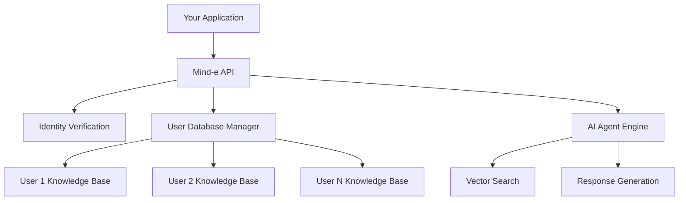

## Overview

Mind-e provides powerful APIs and SDKs for building personalized AI experiences. This technical guide covers everything you need to integrate user-specific AI agents into your applications.

## Architecture

Mind-e uses a **user-isolated architecture** where each user gets their own private knowledge base, ensuring data privacy and personalized AI responses.



## Core Concepts

### User Databases
Each user gets an isolated database containing their documents and data. These databases are:
- **Cryptographically isolated** - Users can only access their own data
- **Automatically managed** - Creation, scaling, and cleanup handled by Mind-e
- **Vector-searchable** - AI-powered semantic search across user documents

### Identity Verification
Secure authentication using HMAC-SHA256 hashing:
- **No password storage** - Only cryptographic hashes are used
- **Per-request verification** - Each API call is individually verified
- **Audit trail** - All access attempts are logged with user context

### Document Processing
Real-time document ingestion with status tracking:
- **Multiple formats** - PDF, Word, HTML, plain text
- **Background processing** - Non-blocking uploads with status callbacks
- **Semantic indexing** - AI-powered content understanding and search

## Quick Integration Paths

Choose your integration approach based on your technical requirements:

<CardGroup cols={2}>
  <Card
    title="🚀 JavaScript SDK"
    icon="js-square"
    href="/developer-guides/javascript-sdk"
  >
    **Best for**: Web applications, React/Vue/Angular apps
    **Setup time**: 15 minutes
    **Features**: Full UI components, real-time chat, file uploads
  </Card>
  <Card
    title="🔧 REST API"
    icon="terminal"
    href="/api-reference/introduction"
  >
    **Best for**: Backend integrations, mobile apps, custom implementations
    **Setup time**: 30 minutes  
    **Features**: Complete control, any programming language
  </Card>
  <Card
    title="📦 Python SDK"
    icon="python"
    href="/developer-guides/python-sdk"
  >
    **Best for**: Data science workflows, Django/Flask apps
    **Setup time**: 10 minutes
    **Features**: Pandas integration, async support
  </Card>
  <Card
    title="🎯 WordPress Plugin"
    icon="wordpress"
    href="/developer-guides/integrations/wordpress"
  >
    **Best for**: WordPress sites, no-code solutions
    **Setup time**: 5 minutes
    **Features**: Shortcodes, widget support, admin interface
  </Card>
</CardGroup>

## Implementation Workflow

<Steps>
  <Step title="Authentication Setup">
    Configure API keys and secret keys for secure communication
    ```bash
    # Get your credentials from the dashboard
    API_KEY="sk-your-api-key"
    SECRET_KEY="your-secret-key"
    AGENT_ID="your-agent-id"
    ```
  </Step>
  
  <Step title="User Database Creation">
    Create isolated knowledge bases for your users
    ```javascript
    await mindE.createUserDatabase(userId);
    ```
  </Step>
  
  <Step title="Document Upload">
    Add user-specific documents to their knowledge base
    ```javascript
    await mindE.uploadDocument(userId, file);
    ```
  </Step>
  
  <Step title="Identity Verification">
    Implement secure user verification in your chat interface
    ```javascript
    const userHash = generateUserHash(userId, secretKey);
    ```
  </Step>
  
  <Step title="Chat Integration">
    Connect your users to their personalized AI agent
    ```javascript
    const response = await mindE.chat(message, userId, userHash);
    ```
  </Step>
</Steps>

## Technical Specifications

### Rate Limits
| Resource | Limit | Scope |
|----------|--------|-------|
| API Requests | 1,000/hour | Per API key |
| File Uploads | 100/hour | Per user |
| Database Creation | 10/minute | Per agent |

### File Support
| Format | Max Size | Processing Time |
|--------|----------|----------------|
| PDF | 10MB | 30-60 seconds |
| Word (DOC/DOCX) | 10MB | 20-40 seconds |
| HTML/HTM | 5MB | 10-20 seconds |
| Plain Text | 2MB | 5-10 seconds |

### Security Features
- **TLS 1.3** encryption for all API communications
- **HMAC-SHA256** for identity verification
- **JWT tokens** for session management
- **Rate limiting** to prevent abuse
- **Audit logging** for compliance

## Code Examples

### Basic User Setup
```javascript
// 1. Create user database
const database = await fetch(`${API_BASE}/user-databases/agents/${AGENT_ID}/users/${userId}/database`, {
  method: 'POST',
  headers: { 'Authorization': `Bearer ${API_KEY}` }
});

// 2. Upload user document
const formData = new FormData();
formData.append('file', userFile);

const upload = await fetch(`${API_BASE}/user-data/agents/${AGENT_ID}/users/${userId}/documents`, {
  method: 'POST',
  headers: { 'Authorization': `Bearer ${API_KEY}` },
  body: formData
});

// 3. Generate secure hash for chat
const userHash = crypto
  .createHmac('sha256', SECRET_KEY)
  .update(userId)
  .digest('hex');
```

### Real-time Status Monitoring
```javascript
// Monitor document processing
async function monitorProcessing(userId) {
  const status = await fetch(`${API_BASE}/user-data/agents/${AGENT_ID}/users/${userId}/status`, {
    headers: { 'Authorization': `Bearer ${API_KEY}` }
  });
  
  const data = await status.json();
  
  if (data.status_summary.processing > 0) {
    // Still processing, check again in 5 seconds
    setTimeout(() => monitorProcessing(userId), 5000);
  } else {
    // All documents processed, ready for chat
    console.log('✅ User knowledge base ready');
  }
}
```

## Error Handling Best Practices

<Accordion title="Common Error Scenarios">
  <AccordionItem title="401 Unauthorized">
    **Cause**: Invalid or missing API key
    **Solution**: Verify your API key is correctly set in the Authorization header
    ```javascript
    headers: {
      'Authorization': `Bearer ${API_KEY}`
    }
    ```
  </AccordionItem>
  
  <AccordionItem title="409 Conflict">
    **Cause**: User database already exists
    **Solution**: Check if database exists before creating
    ```javascript
    try {
      await createUserDatabase(userId);
    } catch (error) {
      if (error.status === 409) {
        console.log('Database already exists, continuing...');
      }
    }
    ```
  </AccordionItem>
  
  <AccordionItem title="429 Rate Limit">
    **Cause**: Too many requests in a short time
    **Solution**: Implement exponential backoff
    ```javascript
    async function retryWithBackoff(fn, maxRetries = 3) {
      for (let i = 0; i < maxRetries; i++) {
        try {
          return await fn();
        } catch (error) {
          if (error.status === 429 && i < maxRetries - 1) {
            await new Promise(resolve => 
              setTimeout(resolve, Math.pow(2, i) * 1000)
            );
          } else {
            throw error;
          }
        }
      }
    }
    ```
  </AccordionItem>
</Accordion>